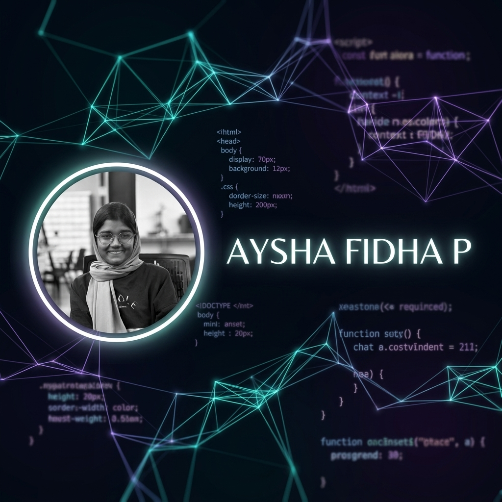

  

<h1 align="center">Hi there! I'm Aysha Fidha P 👋</h1>

  

---

## 💫 About Me

I am a passionate **Computer Science Engineering** undergraduate at **Govt. Model Engineering College, Kochi**. I specialize in building full-stack applications, designing robust RAG (Retrieval-Augmented Generation) systems, and exploring AI and Game Development.

- 🎓 **Education:** B.Tech in Computer Science Engineering (KTU) | **9.46 CGPA** (Expected Graduation: 2027)
- ⚙️ **Key Interests:** Machine Learning, Web Development, Data Analytics, and Game Development.
- 💬 **Ask me about:** React, FastAPI, RAG architecture, and database management.
- 📫 **How to reach me:** [ayshafidhap.mec@gmail.com](mailto:ayshafidhap.mec@gmail.com)

---

## 🛠️ Tech Stack & Skills

  
  
  
  
  
  
  
  
  
  
  
  
  

---

## 🚀 Featured Projects

  
  
  

---

## 🎓 Education

| Institution | Course / Degree | Score / Grades | Duration / Year |
| :--- | :--- | :--- | :--- |
| **Govt. Model Engineering College, Kochi** | B.Tech in Computer Science Engineering (KTU) | **9.46 CGPA** | 2023 - 2027 |
| **GHSS Pattikkad** | 12th State Board | **97.8%** | 2023 |
| **Presentation Higher Secondary School** | 10th State Board | **100%** | 2021 |

---

## 📊 GitHub Analytics

  
  

  

---

## 🐍 Contribution Graph

  <picture>
    <source media="(prefers-color-scheme: dark)" srcset="https://raw.githubusercontent.com/Aysha1313/Aysha1313/output/github-snake-dark.svg" />
    
  </picture>

---

## 📬 Let's Connect!

- 📧 **Email:** [ayshafidhap.mec@gmail.com](mailto:ayshafidhap.mec@gmail.com)
- 💼 **LinkedIn:** [Aysha Fidha P](https://linkedin.com/in/aysha-fidha-p-a627b5291)
- 🔗 **Portfolio:** [aysha-portfolio-taupe.vercel.app](https://aysha-portfolio-taupe.vercel.app)
- 🌐 **GitHub:** [@Aysha1313](https://github.com/Aysha1313)

---

  <i>"Keep coding, keep learning!"</i>

